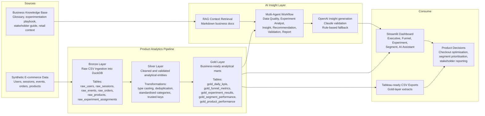
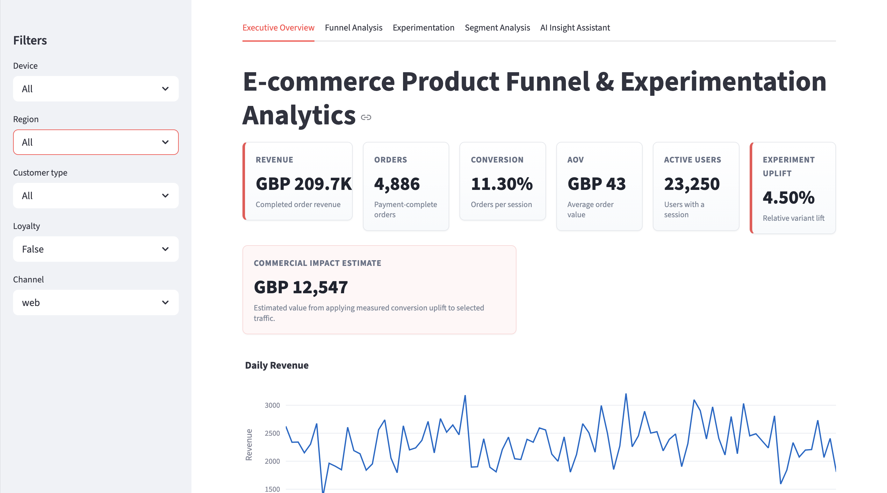
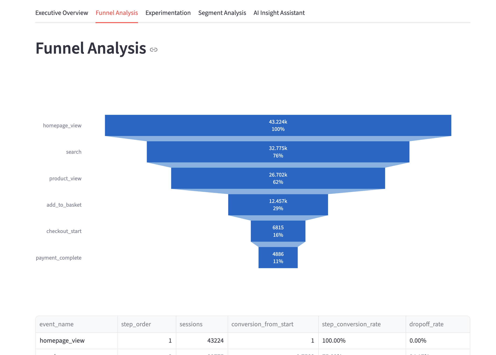
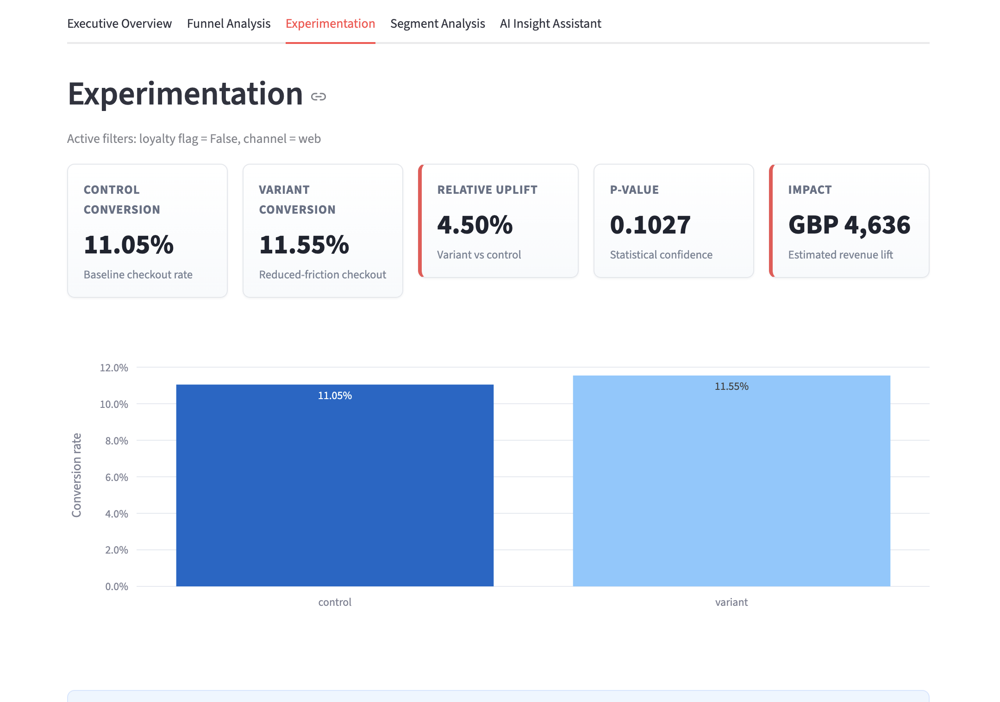
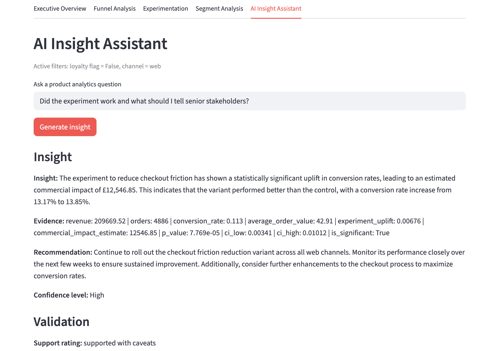

# E-commerce Product Funnel & Experimentation Analytics with AI Insight Agent

## Project Goal

Build an end-to-end product analytics solution that helps retail and e-commerce teams understand customer funnel performance, evaluate checkout experimentation results, identify high-impact customer segments, and generate stakeholder-ready insights using governed AI assistance.

This project is designed to demonstrate the practical skills expected from a Senior Digital Analyst or Product Analyst: SQL-based data modelling, metric definition, experimentation analysis, commercial impact estimation, dashboard storytelling, and responsible AI-assisted insight generation.

## Business Problem

Retail product teams need to understand where customers drop out of the shopping journey, whether checkout experiments improve conversion, and which customer segments should be prioritised. This project creates a realistic local analytics environment that turns raw behavioural data into decision-ready KPIs, funnel diagnostics, experiment readouts, and AI-assisted stakeholder recommendations.

## Why Synthetic Data

The project uses synthetic data first so the full journey can be designed around realistic business questions without privacy issues, missing instrumentation, or Kaggle-specific schema constraints. The generator creates 90 days of grocery/e-commerce sessions, events, orders, product data, and experiment assignments for 50,000 users.

## High-Level Architecture



DuckDB is used as a local SQL OLAP warehouse at `data/processed/ecommerce_analytics.duckdb`. Python orchestrates the pipeline, while SQL performs the main Bronze, Silver, and Gold transformations.

## Medallion Layers

Bronze keeps raw CSV data loaded into DuckDB with minimal assumptions.

Silver cleans types, removes duplicated identifiers, standardises categories, and creates trusted analytical entities.

Gold creates marts for daily KPIs, funnel metrics, experiment results, segment performance, and product performance.

## Dashboard Pages

1. Executive Overview: revenue, orders, conversion, AOV, active users, experiment uplift, and impact estimate.
2. Funnel Analysis: funnel chart, step conversion, drop-off rates, and filters for device, region, customer type, loyalty, and channel.
3. Experimentation: control vs variant conversion, uplift, p-value, confidence interval, revenue impact, and interpretation.
4. Segment Analysis: conversion by device, region, customer type, loyalty, and channel, with mobile checkout insight.
5. AI Insight Assistant: asks business questions and returns insight, evidence, recommendation, confidence, and validation notes.

The experiment is intentionally designed to show realistic product analytics nuance: the variant improves checkout conversion overall, but performance varies by segment. For example, some filtered segments may show weaker or non-significant uplift, which prevents over-generalising the global result.

## Dashboard Preview









## AI Agent Workflow

The assistant uses these agents:

- DataQualityAgent checks missing values, duplicate events, and suspicious funnel drops.
- ExperimentAnalystAgent validates A/B test uplift and statistical significance.
- InsightAgent explains KPI and funnel trends in plain English using calculated metrics.
- RecommendationAgent prioritises product actions by business impact.
- ValidationAgent uses Claude to challenge OpenAI-generated recommendations. If Claude is unavailable, rule-based validation is used.
- ReportAgent creates an executive summary for product managers and senior leaders.

LLM rule: Python and SQL calculate metrics. LLMs only explain numbers already calculated and must not invent metrics.

## RAG Knowledge Base

The AI assistant retrieves context from markdown files in `docs/`:

- Product analytics glossary
- Experimentation playbook
- Stakeholder reporting guide
- Retail product context

If API keys are missing, the app still works and returns a rule-based AI-style summary using dashboard metrics and retrieved context.

## Tableau Exports

Gold-layer CSV files are exported to `data/tableau_exports/`:

- `gold_daily_kpis.csv`
- `gold_funnel_metrics.csv`
- `gold_experiment_results.csv`
- `gold_segment_performance.csv`

These files can be uploaded directly to Tableau Public.

## Setup

```bash
pip install -r requirements.txt
python src/generate_data.py
python src/etl_bronze.py
python src/etl_silver.py
python src/etl_gold.py
streamlit run app/streamlit_app.py
```

Optional API keys:

```bash
cp .env.example .env
```

Then add `OPENAI_API_KEY` and `ANTHROPIC_API_KEY` to `.env`.

## Skills Demonstrated

- Product funnel analytics
- SQL medallion architecture
- DuckDB OLAP modelling
- A/B test analysis and statistical interpretation
- Executive KPI reporting
- Segment diagnostics
- Streamlit dashboard development
- Tableau-ready data exports
- AI insight generation with validation
- RAG over business documentation

## Professional Relevance

This project demonstrates the core work expected in senior digital analytics and product analytics roles: defining reliable product metrics, modelling behavioural data, diagnosing funnel performance, interpreting experimentation results, quantifying commercial impact, and communicating recommendations clearly to product and commercial stakeholders.

It also shows how AI can support analytics workflows responsibly: calculations are handled by SQL and Python, while LLMs are limited to explanation, summarisation, recommendation framing, and validation against measured evidence.
